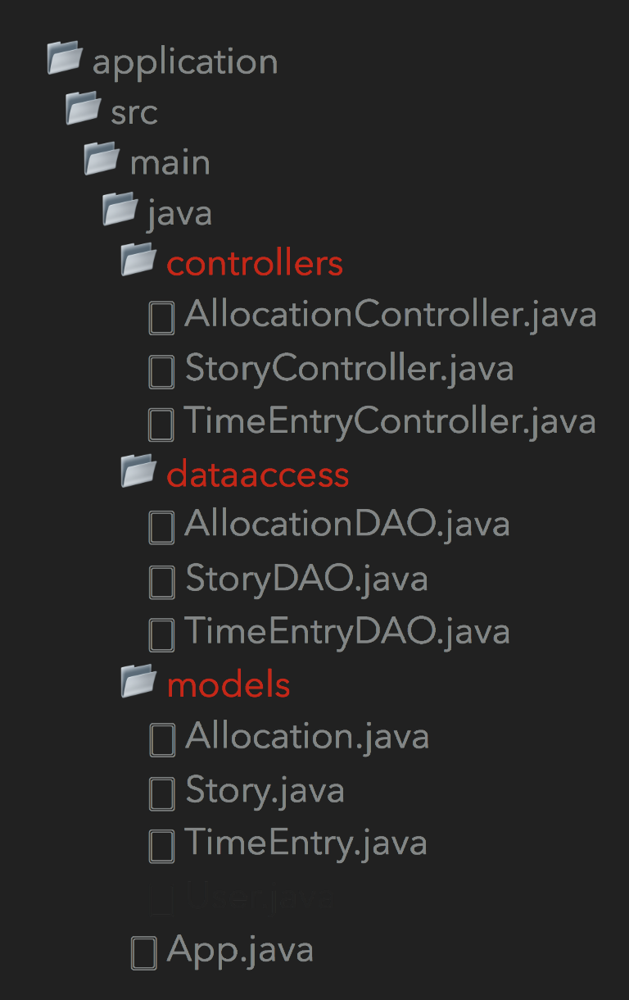
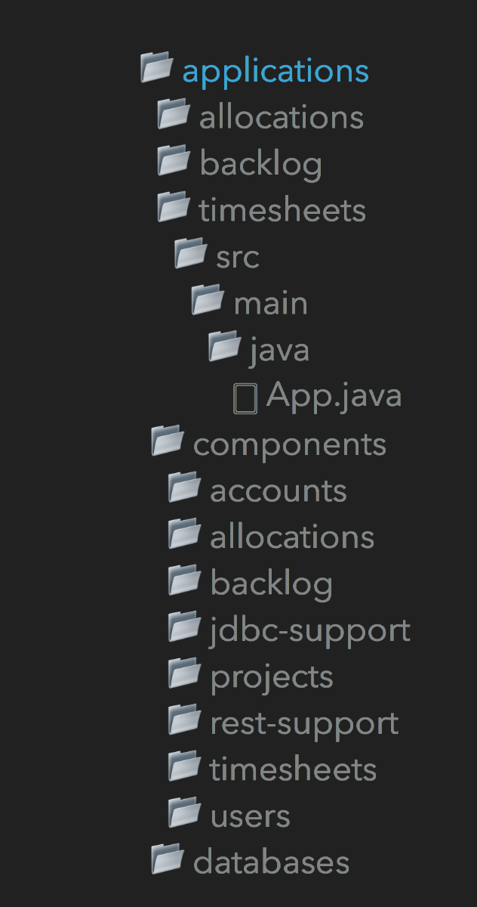

@title[Introduction]
# Platform acceleration labs

<span style="font-size:0.6em">Experience best practices for re-platforming and modernizing apps in a hands-on setting.</span>
<span style="font-size:0.6em">Best practices on building and deploying software according to todays cloud standards.</span>
<span style="font-size:0.6em">Understanding the relevant concepts in the cloud world.</span>

---
@title[tools]
### Recommended tools to build software in the Java ecosystem

- Version Control: git
- Build system: Gradle
- Language flavour: Kotlin

@fa[arrow-down]
+++

#### Gradle

Gradle is a build and dependency management system.

- Easy to understand
+++?code=src/build.gradle&lang=groovy$title=build.gradle
@[1,1] (Build Java)
@[3-9] (Build jar)
@[11-13] (Repository central)
@[15-17] (Dependencies)

+++

#### Gradle
- Programable / Extensible

@fa[arrow-down]
+++

#### Gradle
- Fast


@fa[arrow-down]

+++

#### Kotlin

- "New" language developed by JetBrains.
- Source files compile to Java.
- Perfect integration with Java project.

@fa[arrow-down]
+++?code=src/java/Order.java&lang=java&title=Order class
@fa[arrow-down]
+++?code=src/kotlin/Order.kt&lang=kotlin&title=Order class

---

## Development

[12 Factor application](https://www.12factor.net): Set of suggestions for a piece of software intended to work as Saas.
</br>
Well documented, based on experience.

@fa[arrow-down]

+++
## Development

The Java Framework of choice is Spring Boot.
 - Autoconfiguration
+++?code=src/java/SampleApplication.java&lang=java&title=Application Class
@[3] Spring Application annotation

+++?code=src/java/controller/SampleController.java
@[3,12,17] (Controller annotations)

+++
## Development

Database "migrations" using [Flyway](https://www.flyway.com)

+++?code=src/database/V1__create_table_sample.sql&lang=sql&title=Migrations file.

Run the migrations file
```
flyway -url="jdbc:mysql://localhost:3306/my_database" -locations=filesystem:databases/migrations clean migrate
```
---
## Architecture

[Appcontinuum](http://www.appcontinuum.io) Explains how to address the separation in multiple components in an iterative way.

+++

+++
- Hard to read
- Hard to mantain
- Hard to scale
- Unclear domain
- Potential Circular dependencies
+++

+++
- Clear naming
- Clear domain
- Easy to scale
- Easy to introduce new people

---
## Pivotal Cloud Foundry

[Open source Cloud native platform](https://docs.google.com/presentation/d/1LAapkVrJYJS4Mx5FwawAxHIOmWHH_hbihVpYFaNeaoo/)

---

## Managing the Application's connections
Applications often need to get/receive data from other services.
An app needs to be able to answer the following questions:
- What are the hosts I need to connect to?
- How do other services connect with me?
- What happens if the server I need data form is down?
- How do I authenticate my requests?
- Where is the app config?

### Service discovery
Difficult to hand-configure service clients in the cloud.
@fa[arrow-down]
+++
### Service discovery
Service discovery pattern where the application will request the Service Registry the host/s for the service it needs to connect to.

+++
### Service Discovery
Service Registry for Pivotal Cloud Foundry is based on Eureka, Netflix’s Service Discovery server and client.
+++?code=src/build-service-discovery.gradle
@[6,13] (Adding Eureka Service Registry)
+++?code=src/java/application-server-discovery.properties
+++?code=src/java/ServiceDiscoveryApp.java&lang=java
@[3,15] Annotations
