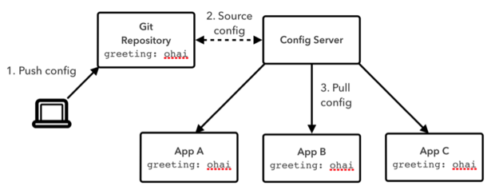

# Platform acceleration labs overview
---
@title[Introduction]
## Introduction
<span style="font-size:0.6em">Experience best practices for re-platforming and modernizing apps in a hands-on setting.</span>
<span style="font-size:0.6em">Best practices on building and deploying software according to todays cloud standards.</span>
<span style="font-size:0.6em">Understanding the relevant concepts in the cloud world.</span>
---
@title[tools]
### Recommended tools to build software in the Java ecosystem
- Version Control: git
- Build system: Gradle
- Language flavour: Kotlin

@fa[arrow-down]
+++
### Gradle
Gradle is a build and dependency management system.
- Easy to understand

@fa[arrow-down]
+++?code=src/build.gradle&lang=groovy$title=build.gradle
@[1,1] (Build Java)
@[3-9] (Build jar)
@[11-13] (Repository central)
@[15-17] (Dependencies)
+++
### Gradle
- Programable / Extensible

@fa[arrow-down]
+++
### Gradle
- Fast


</br>@fa[arrow-down]
+++
### Kotlin
- "New" language developed by JetBrains.
- Source files compile to Java.
- Perfect integration with Java project.

@fa[arrow-down]
+++?code=src/java/Order.java&lang=java&title=Order class
+++?code=src/kotlin/Order.kt&lang=kotlin&title=Order class
---
## Development
[12 Factor application](https://www.12factor.net): Set of suggestions for a piece of software intended to work as Saas.</br>
Well documented, based on experience.
</br>@fa[arrow-down]
+++
## Development
The Java Framework of choice is Spring Boot.
 - Autoconfiguration

@fa[arrow-down]
+++?code=src/java/SampleApplication.java&lang=java&title=Application Class
@[3] Spring Application annotation
+++?code=src/java/controller/SampleController.java&lang=java&title=SampleController
@[3,12,17] (Controller annotations)
+++
## Development
Database "migrations" using [Flyway](https://www.flyway.com)
</br>@fa[arrow-down]
+++?code=src/database/V1__create_table_sample.sql&lang=sql&title=Migrations file
Run the migrations file
```
flyway -url="jdbc:mysql://localhost:3306/my_database" -locations=filesystem:databases/migrations clean migrate
```
---
## Architecture
[Appcontinuum](http://www.appcontinuum.io) Explains how to address the separation in multiple components in an iterative way.
</br>@fa[arrow-down]
+++?image=images/packages-current.png&size=contain
+++
## Architecture
- Hard to read
- Hard to mantain
- Hard to scale
- Unclear domain
- Potential Circular dependencies
+++?image=images/packages-refactored.png&size=contain
+++
## Architecture
- Clear naming
- Clear domain
- Easy to scale
- Easy to introduce new people
---
## Pivotal Cloud Foundry
[Open source Cloud native platform](https://docs.google.com/presentation/d/1LAapkVrJYJS4Mx5FwawAxHIOmWHH_hbihVpYFaNeaoo/)
---
## Managing the Application's connections
<span style="font-size:0.8em">Applications often need to get/receive data from other services.</span></br>
<span style="font-size:0.8em">An app needs to be able to answer the following questions:</span>
- <span style="font-size:0.6em">What are the hosts I need to connect to?</span>
- <span style="font-size:0.6em">How do other services connect with me?</span>
- <span style="font-size:0.6em">What happens if the service I need data from is down?</span>
- <span style="font-size:0.6em">How do I authenticate my requests?</span>
- <span style="font-size:0.6em">Where is the app config?</span>
---
### Service discovery
Difficult to hand-configure service clients in the cloud.
</br>@fa[arrow-down]
+++
### Service discovery
Service discovery pattern where the application will request the Service Registry the host/s for the service it needs to connect to.

+++
### Service Discovery
Service Registry for Pivotal Cloud Foundry is based on Eureka, Netflix’s Service Discovery server and client.
</br>@fa[arrow-down]
+++?code=src/build-service-discovery.gradle&title=Gradle build file
@[6,13] (Adding Eureka Service Registry)
### Service Discovery
+++?code=src/java/application-server-discovery.properties&title=service properties
### Service Discovery
+++?code=src/java/ServiceDiscoveryApp.java&lang=java&title=Main app
@[3,15] (Eureka annotations)
---
### Circuit Breaker
Usually microservices need to connect to different systems (services, DBs, queues...)
Sometimes the connection to those services is not possible.
</br>@fa[arrow-down]
+++
### Circuit Breaker
<span style="font-size:0.8em">The Circuit breaker watches for failing calls to the service. If failures reach a certain threshold, it “opens” the circuit and automatically redirects calls to the specified fallback mechanism</span>

+++
### Circuit Breaker
Circuit Breaker Dashboard is based on Hystrix, Netflix’s latency and fault-tolerance library.
</br>@fa[arrow-down]
+++?code=src/java/CircuitBreakerDemo.java&lang=java&title=Service class
@[14,23] (Hystrix annotations)
---
### Security
Recommended way for securing service-to-service communications is OAuth.</br>
PCF provides an OAuth server that the applications can user for receiving/validating tokens.
</br>@fa[arrow-down]
+++
### Security

---
### Config Server
PCF provides a config server, based on a given repository.</br>
Every push to that repository generates a change in the config server.</br>
Spring cloud config connects the application with the config server.
</br>@fa[arrow-down]
+++
### Config Server

+++
### Config Server
Adding config server to the application:
```groovy
compile "io.pivotal.spring.cloud:spring-cloud-services-starter-config-client"
```
---
### Replatforming vs Modernization
Adapt the application to function correctly in the cloud
- Remove reads/write to disk
- Remove instance specific state

@fa[arrow-down]
+++
### Replatforming vs Modernization
Once in the cloud, bring the technology stack up to date
- DDD, microservices, security, migrations, etc...
---
## Build and Deploy
Use a Manifest file to describe the application's context and dependencies.
```
cf create-service ...
```
+++?code=src/manifest.yml&lang=yaml&title=Manifest file
```
cf push
```
+++
### Using CI
- Use [Concourse](http://concourse-ci.org) as preferred CI system for microservices architecture.
- Define flows composed by tasks, resources and jobs.

</br>@fa[arrow-down]
+++?code=src/ci/build.yml&source=yaml&title=build.yml
+++?code=src/ci/pipeline.yml&source=yaml&title=pipeline.yml
+++
### Using CI
Push the pipeline config to the CI system
```
fly -t demo-server set-pipeline -p demo-server --load-vars-from ci/variables.yml -c ci/pipeline.yml
```
</br>@fa[arrow-down]
+++
### Using CI
Enjoy your creation :-)

---

